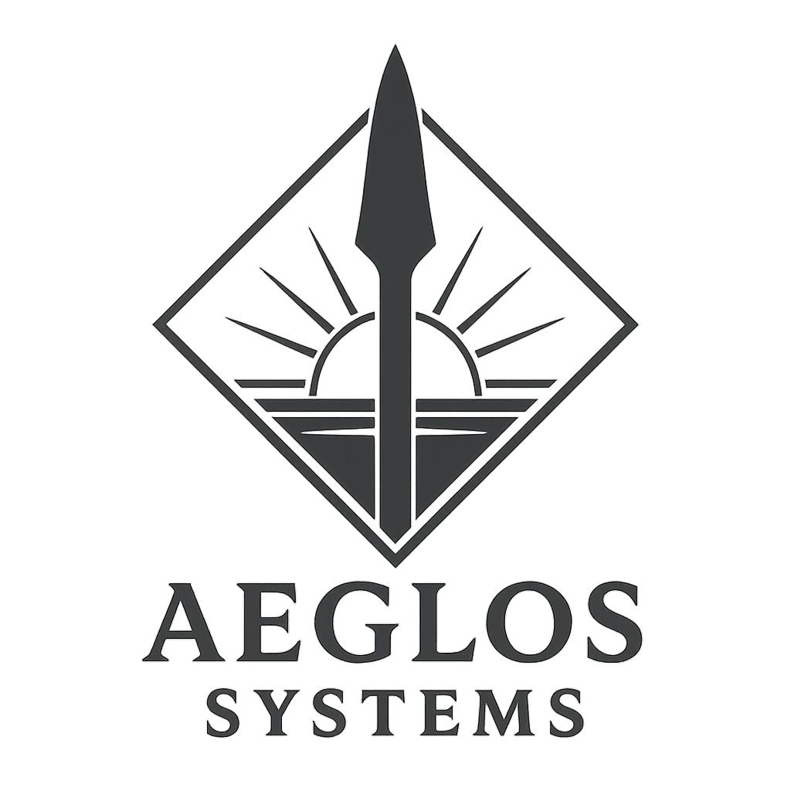

<p align="center">
  
</p>

<h1 align="center">Aeglos OS</h1>

<p align="center">
  <strong>An AI-native operating system. The AI is not an application — the AI is the OS.</strong>
</p>

<p align="center">
  
  
  
  
  
</p>

---

## What is Aeglos OS?

Aeglos OS is a ground-up AI-native operating system written in Rust for AArch64 — built without Linux, without glibc, and without compromise. Every architectural decision — the kernel, the memory model, the security layer, the user interface — was made with one principle: intelligence is not a feature you add to an OS. It is the foundation you build around.

There are no apps. There is no desktop. There is no terminal. There is Aska — an intent-driven shell that understands what you mean — backed by a streaming local LLM, a content-addressable semantic memory layer, and a microkernel that treats AI inference as a first-class system call.

---

## Architecture

```
┌─────────────────────────────────────────────────┐
│               Aska — AI Shell                    │
│    Natural language · Streaming inference        │
│    Tiling compositor · Intent decomposition      │
├─────────────────────────────────────────────────┤
│          Semantic Memory (Ithildin)              │
│   Content-addressable · Vector search            │
│   SHA-256 hashed blobs · Embedding index         │
├───────────────────────┬─────────────────────────┤
│  Numenor AI Runtime   │   WASM App Sandbox       │
│  llama.cpp · GGUF     │   Capability-gated        │
│  Streaming tokens     │   Third-party isolation   │
├───────────────────────┴─────────────────────────┤
│              Aeglos Microkernel                  │
│  AI syscalls · IPC · Capability security         │
│  SMP scheduler · CSPRNG · ASLR                   │
│  TCP/IPv4/IPv6 · TLS 1.3 · WebSocket             │
│  FAT32 · VFS · NVMe · PCIe                       │
├─────────────────────────────────────────────────┤
│         Hardware Abstraction (AArch64)           │
│  MMU · GIC/AIC · VirtIO · E1000 · HDA · NVMe    │
│  Apple Silicon (M1–M4) · QEMU virt               │
└─────────────────────────────────────────────────┘
```

---

## Components

| Component | Role |
|-----------|------|
| **Aeglos Kernel** | Custom AArch64 microkernel in Rust (`no_std`). Manages memory, IPC, processes, and exposes AI-native syscalls (`ai_infer`, `ai_embed`, `ai_schedule_hint`). |
| **Numenor** | AI runtime service. Wraps llama.cpp with a Rust IPC layer. Streams tokens per-message, manages dual-model fast/slow routing, and exposes inference to all system components. |
| **Ithildin** | Semantic memory layer. Replaces the hierarchical filesystem with content-addressable, semantically-indexed storage. Every object has a SHA-256 hash and an embedding vector. |
| **Aska** | AI shell and compositor. The primary user interface — conversational, intent-driven, with a fallback tiling window manager. Not a terminal emulator. |

---

## What's implemented

### Kernel
- Custom AArch64 microkernel with 85+ syscalls
- 4-level page tables, TTBR0/TTBR1 VA split, per-process isolation
- Preemptive SMP scheduler with work-stealing and AI-aware task pinning
- Message-passing IPC subsystem
- Capability-based security — no root, only fine-grained capability bitmasks
- Syscall allow-listing (seccomp-equivalent) per task
- ASLR with 14,336 position slots per PIE binary
- ChaCha20-DRBG seeded by ARMv8.5 RNDR hardware entropy
- `fork`/`clone`, `mmap`/`munmap`, pipes, signals, environment variables

### Network
- Full TCP/IPv4/IPv6 dual-stack implementation (not lwIP)
- TLS 1.3: X25519, AES-256-GCM, HMAC-SHA256, HKDF, X.509 certificate verification
- HTTPS GET/POST, WebSocket (RFC 6455), DNS, DHCP, SLAAC, NDP, ICMPv6
- EL0 raw socket syscalls (`TCP_CONNECT`, `LISTEN`, `ACCEPT`, `READ`, `WRITE`)

### AI Runtime (Numenor)
- Streaming per-token inference via IPC
- Dual-model routing: Qwen3-0.6B (fast path) + Qwen3-8B (main)
- 4KB rolling conversation history
- Structured tool calling: `[[TOOL:args]]` syntax with 11 built-in tools
  - FETCH, POST, DNS, PING, LS, CAT, SAVE, MEM_STORE, MEM_RECALL, STATS, SPEAK
- Embedding generation and hot-reload without restart
- Voice/TTS output via Intel HDA driver

### Semantic Memory (Ithildin)
- SHA-256 content-addressable blob store
- Tag-based metadata store with timestamps and relationships
- Vector embedding index for semantic search
- Natural language query interface
- Block device abstraction for persistent storage

### Shell & GUI (Aska)
- Conversational intent-based interface (not a terminal)
- 30+ structured commands, pipes, background jobs, tab completion, readline history
- Live per-token LLM rendering in the chat panel
- Multi-window GPU compositor with dirty-flag optimisation
- Drag-and-drop, clipboard (Ctrl+C/V), vector/TrueType font rendering
- App launcher (ELF binary execution with capability inheritance)

### Storage & Filesystem
- FAT32 with full subdirectory support
- VFS unification: `/proc/`, `/mem/`, FAT32 unified under one fd namespace
- Persistent key-value configuration store with atomic writes (write-rename)

### Security
- Capability-based security model (`CAP_IO`, `CAP_NET`, `CAP_FB`, `CAP_AI`, `CAP_LOG`)
- Per-process syscall filter bitmap (128 syscalls, checked before capability gating)
- Capability inheritance: child process cannot exceed parent's capability set
- WASM sandboxing for third-party application isolation
- TLS certificate verification (hostname match, validity window, CN/SAN, RFC 2818/6125)

---

## Build & Run

### Requirements

- Rust nightly (see `rust-toolchain.toml`)
- QEMU: `qemu-system-aarch64`
- macOS or Linux host

### Quick start

```bash
# Clone the repository
git clone https://github.com/EnzoSemper/Aeglos.OS.git
cd Aeglos.OS

# Install Rust nightly + required components
rustup toolchain install nightly
rustup component add rust-src llvm-tools

# Build and run in QEMU (text mode)
./tools/build.sh

# Build and run with framebuffer display
./tools/build.sh display
```

### Build script targets

```bash
./tools/build.sh          # Build kernel + FAT32 image + run in QEMU
./tools/build.sh build    # Build only
./tools/build.sh run      # Run (assumes pre-built kernel)
./tools/build.sh display  # Build + run with GUI framebuffer output
```

### Manual kernel build

```bash
cd kernel
cargo build --target aarch64-unknown-none.json --release
```

### QEMU command

```bash
qemu-system-aarch64 \
  -machine virt \
  -cpu cortex-a72 \
  -m 512M \
  -nographic \
  -kernel kernel/target/aarch64-unknown-none/release/aeglos
```

---

## Models

Aeglos OS uses GGUF-format models via llama.cpp. The build script downloads models automatically if absent.

| Model | File | Size | Role |
|-------|------|------|------|
| Qwen3-8B Q4_K_M | `model.gguf` | ~4.7 GB | Main inference |
| Qwen3-0.6B | `model_fast.gguf` | ~400 MB | Fast-path routing |

Models are stored outside the repository and excluded from version control.

---

## Target Hardware

| Platform | Status |
|----------|--------|
| QEMU `virt` (AArch64) | Primary development target |
| Apple Silicon (M1, M2, M3, M4) | Supported via AIC interrupt controller |
| Generic AArch64 (Graviton, RPi) | Supported via GIC interrupt controller |
| x86_64 | Planned |
| RISC-V | Planned |

---

## Project Status

Phase 0 is complete. All core subsystems are implemented and communicating:

- [x] Microkernel with full syscall surface
- [x] Streaming AI inference with dual-model routing
- [x] Semantic memory with vector search
- [x] Multi-window compositor and AI shell
- [x] Full network stack (TCP, TLS 1.3, WebSocket)
- [x] SMP scheduling, ASLR, capability security
- [ ] x86_64 port
- [ ] RISC-V port
- [ ] UEFI bootloader (in progress)
- [ ] Package/app distribution system

See [`docs/PHASE0.md`](docs/PHASE0.md) for the full implementation status table.

---

## Repository Structure

```
aeglos-os/
├── kernel/          Microkernel (Rust, no_std, AArch64)
│   └── src/
│       ├── arch/    MMU, GIC, AIC, exceptions, timer
│       ├── drivers/ VirtIO, E1000, NVMe, HDA, PCIe, framebuffer
│       ├── net/     TCP, TLS, HTTP, WebSocket, DNS
│       ├── fs/      FAT32, VFS
│       ├── process/ Scheduler, ELF loader, context switch
│       ├── ipc/     Message-passing subsystem
│       ├── wasm/    WebAssembly interpreter
│       └── syscall/ All 85+ syscall handlers
├── numenor/         AI runtime (Rust + C++ llama.cpp wrapper)
├── semantic/        Semantic memory layer (Rust)
├── aska/            AI shell and compositor (Rust)
├── userspace/       Bootloader, installer, legacy shell
├── docs/            SPEC.md, PHASE0.md
├── tools/           build.sh, pkg_server.py, grub.cfg
└── vendor/          llama.cpp, lwip (fetched separately)
```

---

## Design Principles

**No legacy.** This is not a fork or derivative. Novel kernel, novel architecture, novel interaction model.

**AI as primitive.** Inference is a syscall, not a library. The scheduler understands AI workloads. Memory is semantically indexed at the storage layer.

**Capability over root.** No superuser. Every process holds a capability bitmask. No capability can be granted that the grantor does not itself hold.

**Minimal privilege.** Microkernel architecture: drivers and services run in user mode (EL0). The privileged kernel surface is as small as possible.

**Local first.** All inference runs on-device. No telemetry. No cloud dependency.

---

## Naming

All major components use names from Tolkien's legendarium, consistent with the Aeglos Systems brand:

| Component | Name | Reference |
|-----------|------|-----------|
| Kernel | **Aeglos** | *Snow-point* — the spear of Gil-galad |
| AI Runtime | **Numenor** | The isle of the Dúnedain — seat of power |
| Semantic Memory | **Ithildin** | *Moon-letters* — knowledge revealed only by the right query |
| AI Shell | **Aska** | Old Norse: the ash tree (Yggdrasil — the world tree) |

---

## License

Copyright © 2026 Aeglos Systems LLC. All rights reserved.

This software and its source code are proprietary. No part may be reproduced, distributed, or used without express written permission from Aeglos Systems LLC.

---

<p align="center">
  <em>Aeglos Systems LLC &nbsp;·&nbsp; aeglos.systems</em><br>
  <em>"Not an AI on an OS. The AI is the OS."</em>
</p>
